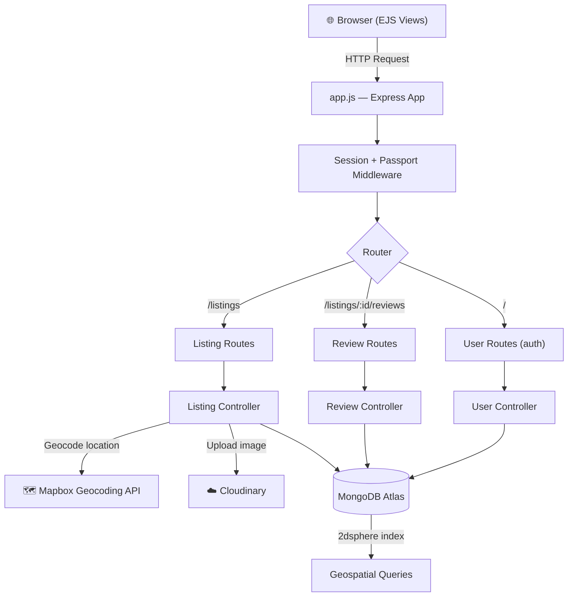
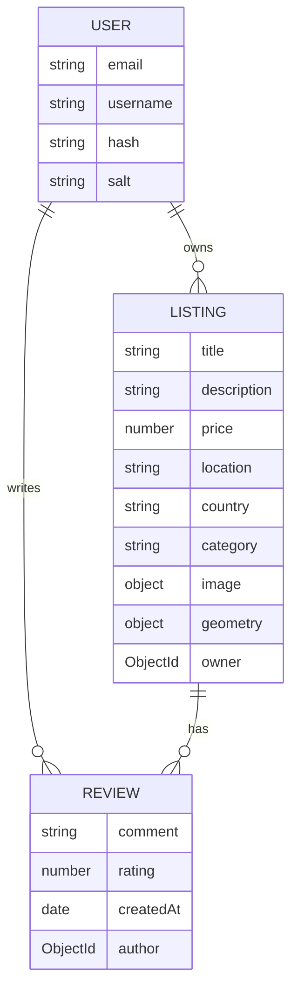
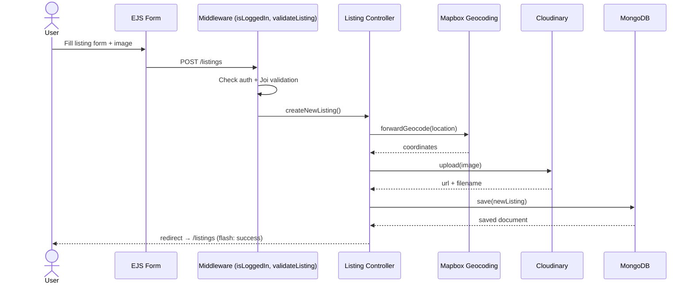

<div align="center">

# 🏡 StayFinder

**An Airbnb-style full-stack listing & booking platform**

Built with Node.js, Express, MongoDB & EJS — geospatial search, cloud image hosting, and secure session-based auth.


</div>

---

## 📌 Overview

StayFinder is a full-stack MVC web app where users can list properties, browse/search stays by category or keyword, view them on an interactive Mapbox map, book/review listings, and manage their own listings — all backed by MongoDB with 2dsphere geospatial indexing for location-aware queries.

---

## 🧱 Tech Stack

| Layer | Technology |
|---|---|
| Runtime | Node.js (≥ 18) |
| Framework | Express 5 |
| Database | MongoDB Atlas + Mongoose |
| Templating | EJS + `ejs-mate` (layouts) |
| Auth | Passport.js (Local Strategy) + `express-session` + `connect-mongo` |
| File Uploads | Multer + Cloudinary (`multer-storage-cloudinary`) |
| Geocoding / Maps | Mapbox SDK (forward geocoding) |
| Validation | Joi |
| Flash Messages | `connect-flash` |

---

## 🏗️ Architecture



---

## 🗂️ Data Model



**Listing categories:** Trending · Rooms · Iconic Cities · Beachfront · Mountains · Countryside · Islands · Lakefront · Castles

---

## 🔁 Request Lifecycle — Creating a Listing



---

## ✨ Features

- 🔍 **Search & filter** — keyword search (title/location/country) with regex-injection protection, plus category filters
- 🗺️ **Geospatial listings** — Mapbox forward geocoding stores real coordinates (`2dsphere`) per listing, rendered on an interactive map
- 🔐 **Authentication** — Passport Local Strategy, hashed + salted credentials, session persisted in MongoDB (`connect-mongo`)
- 🔁 **Redirect-after-login** — remembers the page a guest was trying to reach and sends them back post-login
- ☁️ **Image uploads** — Multer → Cloudinary pipeline with on-the-fly transformed thumbnails
- ⭐ **Reviews** — rating (1–5) + comment, cascade-deleted when a listing is removed
- 🛡️ **Authorization guards** — `isOwner` / `isReviewAuthor` middleware so only the creator can edit/delete their listing or review
- ✅ **Server-side validation** — Joi schemas on both listing and review payloads
- 🧯 **Centralized error handling** — custom `ExpressError` + `wrapAsync` to avoid repetitive try/catch, custom 404/500 views

---

## 🌐 Routes

| Method | Route | Purpose | Protected |
|---|---|---|---|
| `GET` | `/listings` | Index — search + category filter | — |
| `GET` | `/listings/new` | New listing form | ✅ login |
| `POST` | `/listings` | Create listing | ✅ login |
| `GET` | `/listings/:id` | Show listing | — |
| `GET` | `/listings/:id/edit` | Edit form | ✅ owner |
| `PUT` | `/listings/:id` | Update listing | ✅ owner |
| `DELETE` | `/listings/:id` | Delete listing | ✅ owner |
| `POST` | `/listings/:id/reviews` | Add review | ✅ login |
| `DELETE` | `/listings/:id/reviews/:reviewId` | Delete review | ✅ author |
| `GET/POST` | `/signup` | Register | — |
| `GET/POST` | `/login` | Login | — |
| `GET` | `/logout` | Logout | ✅ login |

---

## 📁 Project Structure

```
stayfinder/
├── app.js                  # Express app entry point
├── cloudConfig.js          # Cloudinary + Multer storage config
├── schema.js                # Joi validation schemas
├── middleware.js            # Auth guards, validation, ownership checks
├── controllers/
│   ├── listings.js
│   ├── review.js
│   └── user.js
├── models/
│   ├── listing.js           # Listing schema + geometry + cascade delete
│   ├── review.js
│   └── user.js               # passport-local-mongoose plugin
├── routes/
│   ├── listing.js
│   ├── review.js
│   └── user.js
├── utils/
│   ├── ExpressError.js
│   └── wrapAsync.js
├── views/                    # EJS templates (layouts, listings, users)
├── public/                    # CSS, client JS, static images
└── init/                      # Seed script + sample data
```

---

## ⚙️ Setup & Installation

```bash
# 1. Clone
git clone https://github.com/himanshusaini4589-lgtm/stayfinder.git
cd stayfinder

# 2. Install dependencies
npm install

# 3. Configure environment variables (create a .env file)
ATLASDB_URL=your_mongodb_atlas_connection_string
SECRET_KEY=your_session_secret
MAP_TOKEN=your_mapbox_access_token
CLOUD_NAME=your_cloudinary_cloud_name
CLOUD_API_KEY=your_cloudinary_api_key
CLOUD_API_SECRET=your_cloudinary_api_secret

# 4. (Optional) seed sample listings
node init/index.js

# 5. Run
npm start
# → Server runs on http://localhost:8080
```

---

## 🔐 Security Notes

- Passwords are never stored raw — handled via `passport-local-mongoose` (PBKDF2 hash + salt)
- Search input is regex-escaped before querying to prevent ReDoS / injection
- Session cookies are `httpOnly`, session store is DB-backed (survives server restarts)
- Ownership middleware (`isOwner`, `isReviewAuthor`) prevents unauthorized edits/deletes at the route level, not just the UI

---

## 🗺️ Roadmap

- [ ] Booking/date-availability system (calendar-based reservations)
- [ ] Payment integration
- [ ] Wishlist/favorites
- [ ] Host dashboard with analytics
- [ ] REST API layer for a decoupled frontend (React/Next.js)

---

## 📄 License

ISC

---

<div align="center">
Built by <a href="https://github.com/himanshusaini4589-lgtm">Himanshu Saini</a>
</div>
